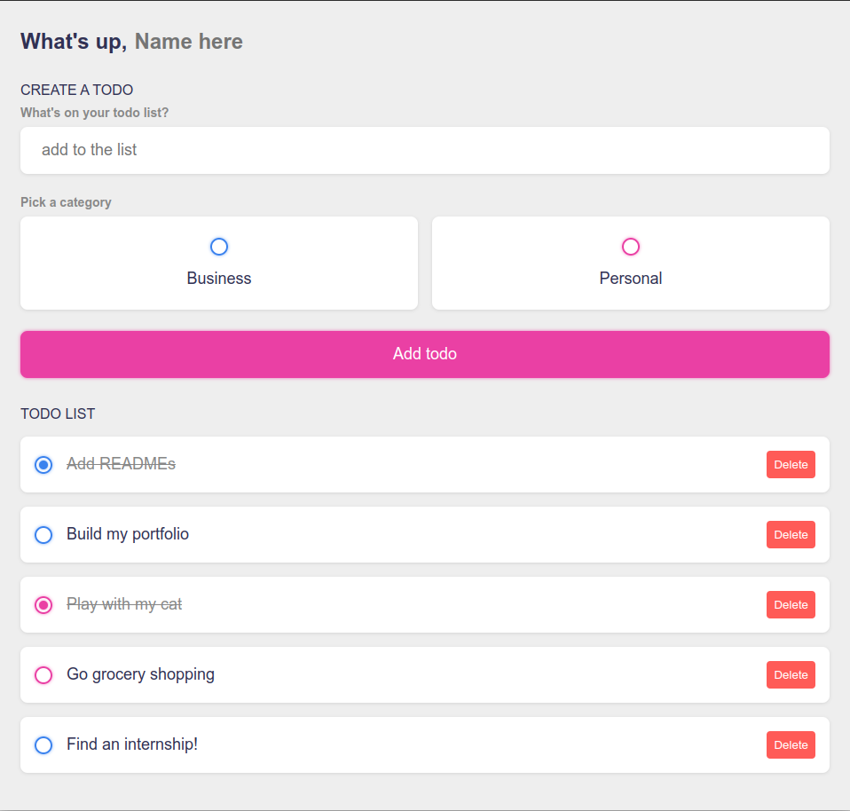

# Vue.js to-do list

This **to-do list** is a **student project** I built in **Ludovic Laloux's class** during my Continuing Education course at **Toulouse Institute of Technology**.

Working on this project, I learned to use **Vue.js 3**. I also added a stylish touch using **CSS**.

## Technologies 

- Vue.js 3
- CSS

## Skills 

- Create a **single page application** using **Vue.js** and **Vite**
- Handle **user inputs** with the **v-model** directive
- Respond to and handle user events with **event handlers**
- Use **computed properties** to iterate through arrays and objects
- Use **lifecycle hooks** to run code at specific stages
- **Store data** in / **retrieve data** from **local storage**

## Functionalities

- Persistent name and to-do list
- Add tasks to the to-do list
- Pick a category between Business and Personal for each task
- Seamlessly edit tasks
- Delete tasks

## Credit

- [Course Source Code](https://github.com/ludolaloux13/vuejs-n7)
